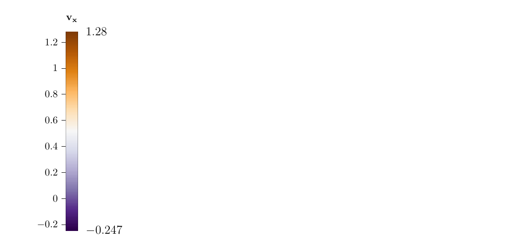

Matplotlib/Paraview Colorbars in TiKZ
---

This python code generates a `TiKZ` file with a colorbar to annotate plots that
are, e.g., exported from paraview.

## Example



## Example Setup

```
python3 colobar.py  # adjust here for colorbars and ranges
pdflatex minilat.tex  # this includes the generated `colorbar.tikz`
```

## Dependencies

```
pip install tikzplotlib
```
